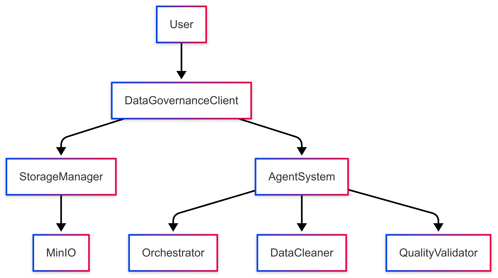
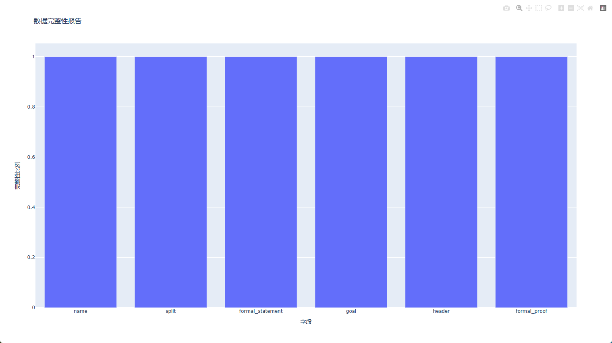

# Data Governance Tool

[](LICENSE)
[](https://www.python.org/)

An automated data governance tool for cleaning, masking, and validating datasets with MinIO integration and multi-agent collaboration.

---

## 🚀 Features

- **Data Cleaning & Masking**  
  Truncate and hash sensitive fields (e.g., SHA-256 for `name` fields).
- **Null Value Imputation**  
  Optimize missing values using `IterativeImputer` for numeric columns.
- **Interactive Reports**  
  Generate JSON summaries and Plotly-powered HTML visualizations.
- **MinIO Integration**  
  Seamlessly read/write files from/to MinIO buckets.
- **Multi-Agent Workflow**  
  Coordinate tasks with roles: Orchestrator, DataCleaner, QualityValidator, etc.

---

## 📦 Installation

### Dependencies
```bash
pip install -r requirements.txt
```

### Clone Repository
```bash
git clone https://github.com/madaibaba/dataagent.git
cd dataagent
```

---

## 🛠️ Configuration

Edit `demo.py` with your MinIO and AI service credentials:

```python
client = DataGovernanceClient(
    minio_endpoint="your-minio-endpoint:9000",
    minio_access="your-access-key",
    minio_secret="your-secret-key",
    ollama_config={
        "model": "your-llm-model",
        "base_url": "http://your-llm-api-url/v1",
        "api_key": "your-api-key" 
    },
    bucket="your-bucket-name",
    base_path="your-project-path"
)
```

---

## 🚦 Usage

### Process a Directory
```python
result = client.process_directory(
    input_prefix="raw",  # Process files in base_path/raw/
    sensitive_fields=["name", "email"],  # Fields to mask
    max_workers=4  # Parallel threads
)
```

### Expected Output
```
Batch Processing Result:
Total Files: 5
Succeeded: 5
Failed: 0
Reports saved to: base_path/report/
```

---

## 📊 System Architecture

  

---

## 🔧 Implementation Details

### Data Masking Logic
```python
# Truncate + Hash sensitive fields
df[col] = df[col].apply(
    lambda x: str(x)[:6] + hashlib.sha256(str(x).encode()).hexdigest()[:6]
)
```

### Report Generation
  
*Interactive HTML report generated with Plotly.*

---

## 🤝 Contributing

1. Fork the repository
2. Create a feature branch (`git checkout -b feature/your-idea`)
3. Commit changes (`git commit -m 'Add amazing feature'`)
4. Push to branch (`git push origin feature/your-idea`)
5. Open a Pull Request

---

## 📜 License

This project is licensed under the MIT License. See [LICENSE](LICENSE) for details.

---

## 📧 Contact

For questions or feedback:  
📩 houalex@gmail.com  
🌐 [Project Wiki](https://github.com/madaibaba/dataagent/wiki)
